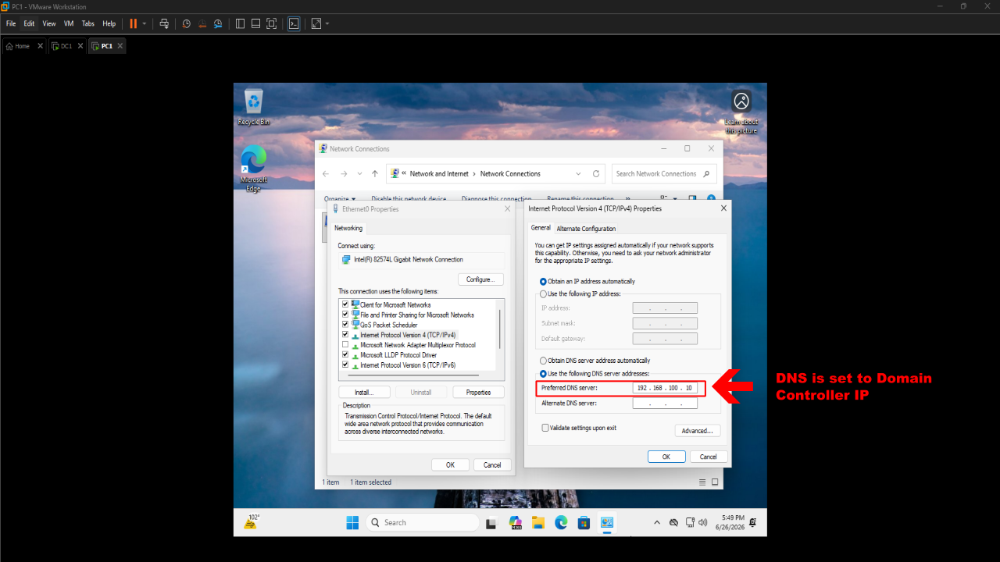
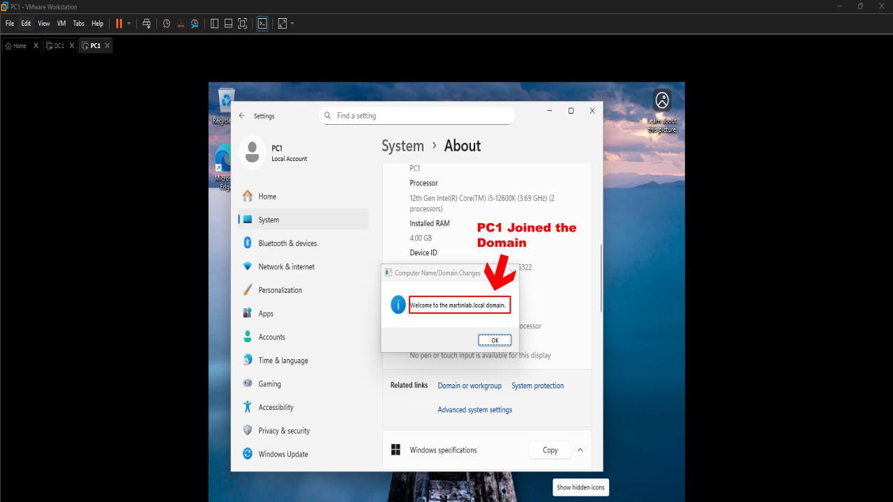
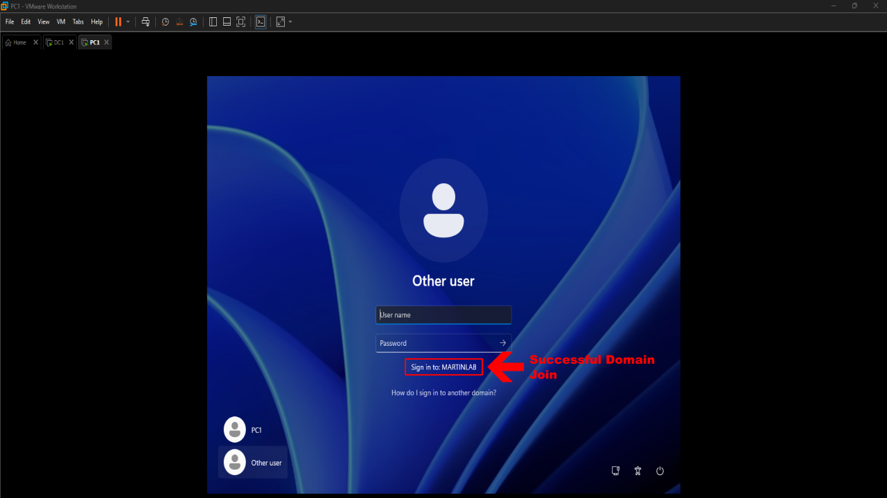
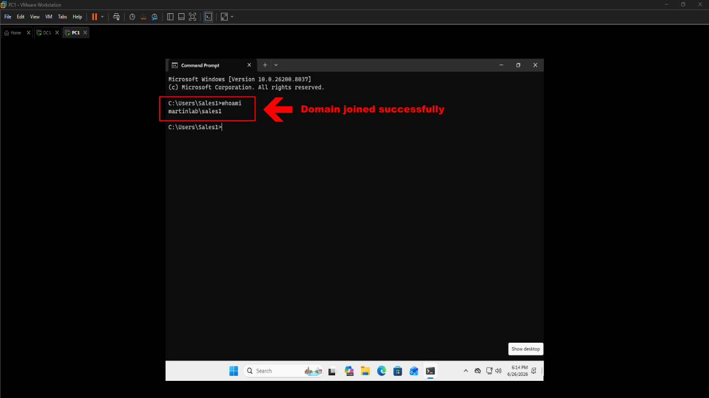

# Domain Join

## Objective
Join a Windows 11 workstation to an Active Directory domain and verify successful domain authentication.

## Steps Performed

1. Installed Windows 11 to a client workstation (PC1).
2. Configured the workstation's preferred DNS server to use the Domain Controller's IP address.

3. Verified network connectivity between the workstation and the Domain Controller.
4. Joined the Windows 11 workstation to the martinlab.local Active Directory domain.

5. Restarted the workstation to complete the domain join process.

6. Logged in using a domain user account from martinlab.local
7. Verified successful domain authentication and domain membership.

## Results

- Successfully joined a Windows 11 workstation to the martinlab.local domain.
- Confirmed communication with the Domain Controller through DNS.
- Authenticated with a domain user account.
- Verified that the workstation is managed by Active Directory and can receive domain-based policies and permissions.
