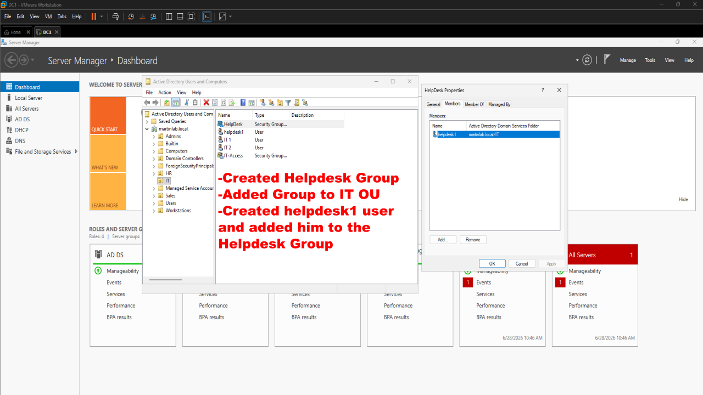
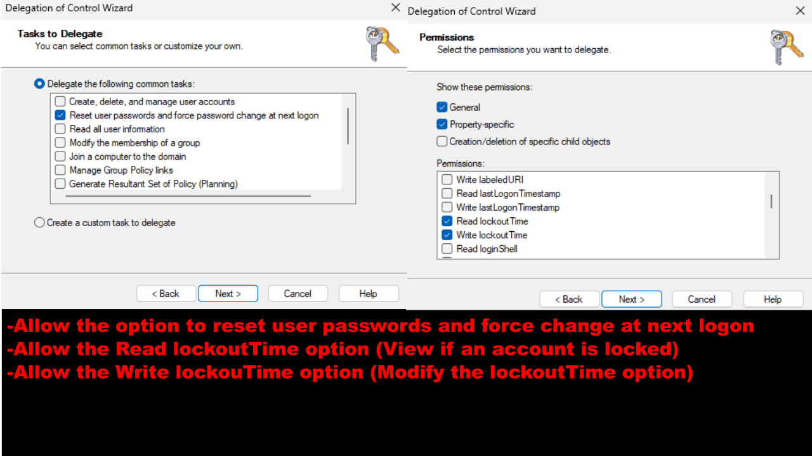
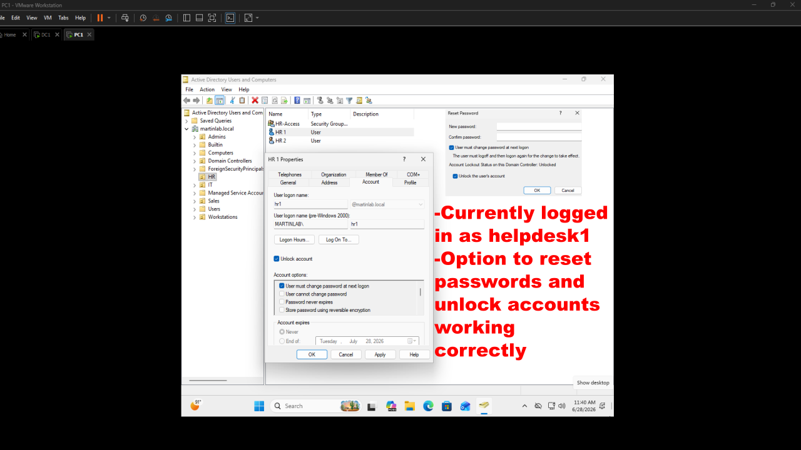
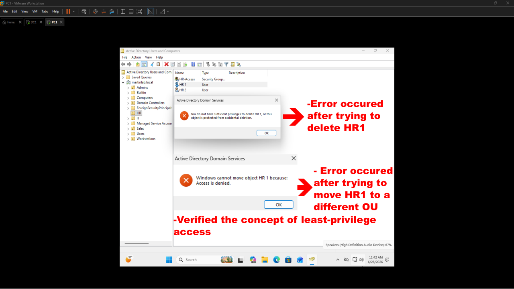

# Delegation of Control (Helpdesk Permissions)

## Objective

Configured delegated permissions in Active Directory to allow helpdesk personnel to reset passwords and unlock user accounts granting Domain Admin privleges.

## Steps Performed

1. Created a dedicated Helpdesk secruity group.
2. Created Helpdesk user account.

3. Delegated password reset permissions and account unlock permissions to the Helpdesk group.

4. Tested delegated access using a non-administrative Helpdesk account.

5. Verified least-privelege access by confimring administrastive functions remained restricted.

## Results

Successfully implemented role-based access control (RBAC) by granting Helpdesk staff the ability to reset passwords and unlock accounts while preventing unauthorized administrative actions. This configuration mirrors common enterprise Active Directory environments and demonstrates the principle of least privelege.
