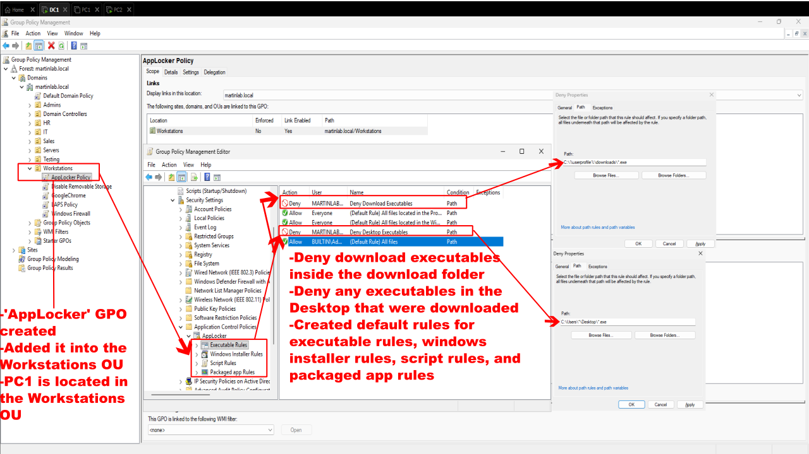
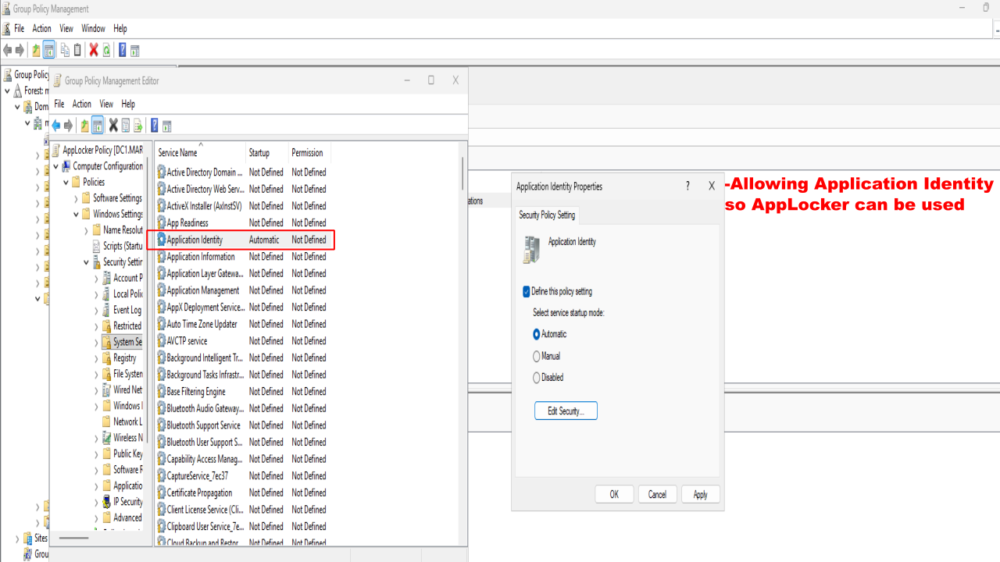

# AppLocker Policy

## Objective

Configure and deploy an AppLocker policy using Group Policy to restrict users from executing unauthorized applications from common user-writable locations, such as Downloads, and Desktop folders, while allowing trusted Windows applications to continue running.

## Steps Performed

1. Created the AppLocker Group Policy
  - Created a new Group Policy named: COMPUTER: AppLocker Policy
  - Linked the GPO to the Workstations Organizational Unit, which contains the PC1
  - Configued AppLocker to:
    - Deny executable files from running within the user's Downloads Folder
    - Deny executable files from runnning from the user's Desktop 
  - Created the default AppLocker rules for all rule collections

2. Enabled the AppLocker Identity Service
  - Configured the Application Identity service to start automatically.

3. Verified the AppLocker Policy
  - Logged into PC1 using teh Sales1 domain user
    - Downloaded an .exe file to the Downloads folder and got denied when launching the application
    - Moved the .exe file to Desktop and got denied when launching the application

## Result

Successfully deployed and enforced an AppLocker policy using Group Policy.

The policy allowed trusted windows applications to execute while preventing users from launching unauthorized executable files from the Downloads and Desktop folders. This demonstrates how AppLocker can be used to improve endpoint security by reducing the risk of malware execution and unauthorized software installations.
