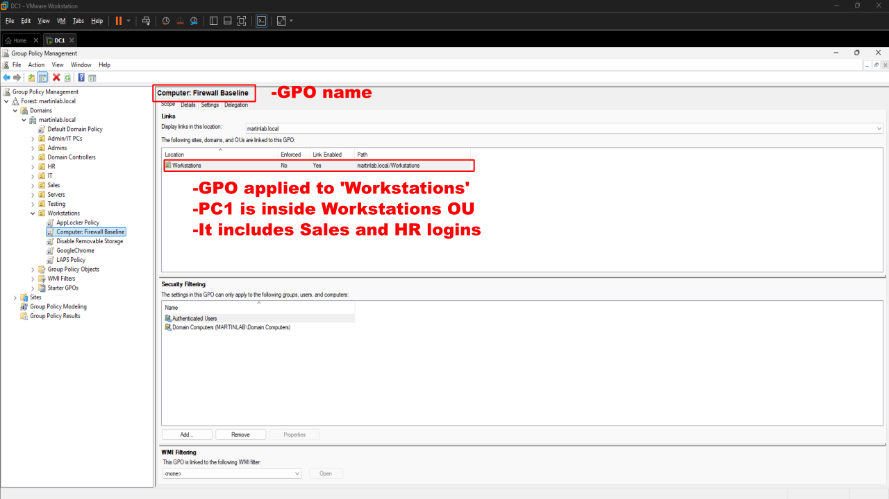
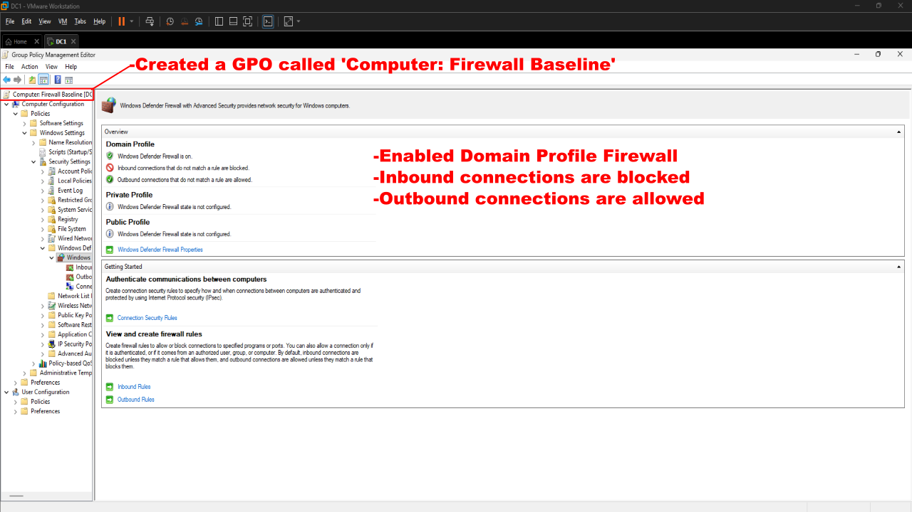
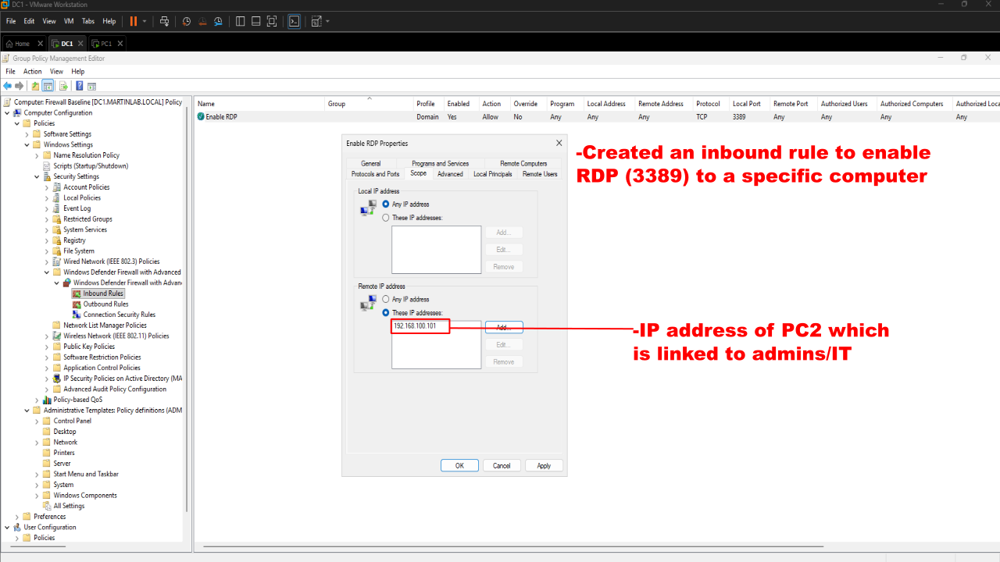
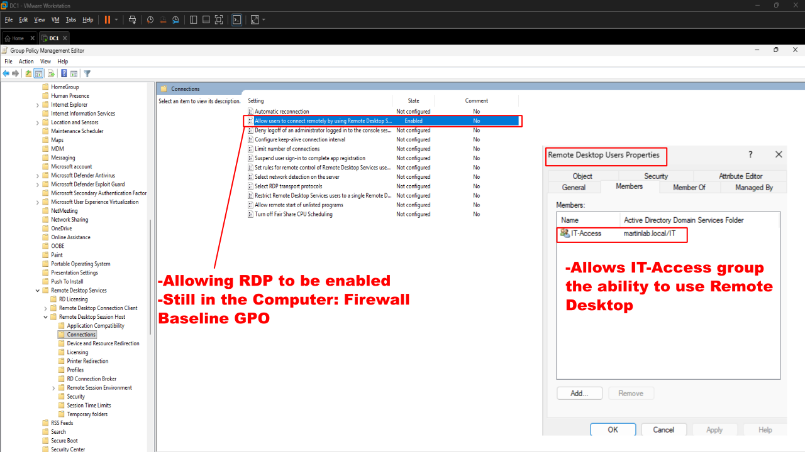
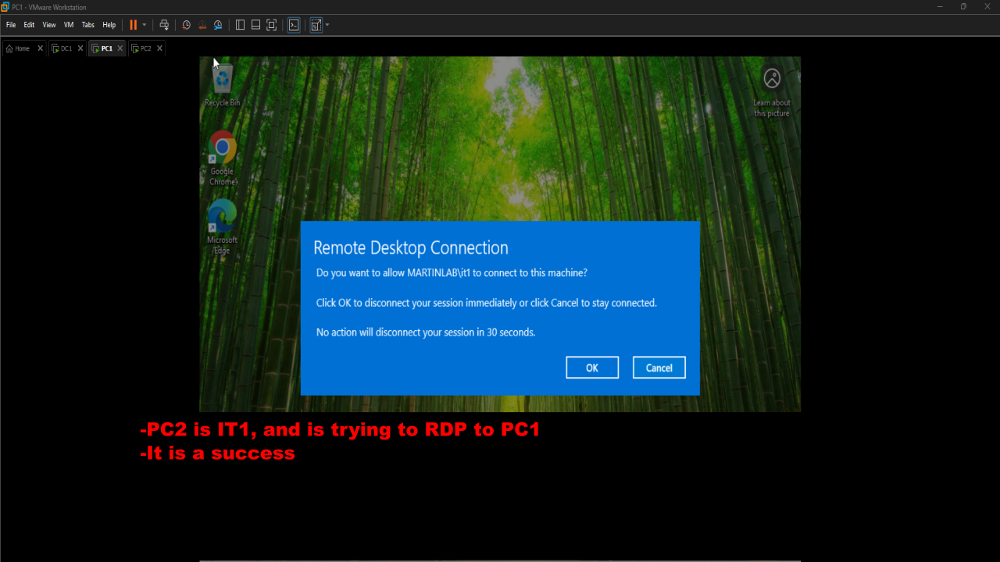

# Remote Desktop & Firewall Management

## Objective

Configure and deploy a Group Policy Object (GPO) to establish a secure Windows Defender Firewall baseline while controlling Remote Desktop (RDP) access through Active Directory security groups and firewall rules.

## Policies Implemented

- Windows Defender Firewall Baseline
- Domain Firewall Profile Configuration
- Inbound Connection Blocking
- Outbound Connection Allowance
- Remote Desktop (RDP) Firewall Rule
- Remote Desktop User Group Assignment
- Group Policy Verification

## Steps Performed

1. Created a GPO: 'Computer: Firewall Baseline' and linked it to the 'Workstations' Organizational Unit containing domain workstations.

2. Configured a Firewall Baseline (GPO) with the following settings:
  - Enabled Windows Defender Firewall for the Domain Profile.
  - Blocked all inbound connections by default.
  - Allowed all outbound connections.

3. Created an inbound firewall rule to allow Remote Desktop Protocol (TCP Port 3389) for the designated IT workstation (PC2).

4. Enabled Remote Desktop through the Firewall Baseline (GPO) to allow authorized remote administration.

5. Added the IT-Access security group to the local Remote Desktop Users group to grant RDP permissions only to authorized administrators.
6. Verified successful Group Policy deployment by running:
  - gpupdate /force
  - gpresult /r

7. Tested Remote Desktop connectivity:
  - Attempted an RDP connection from PC1 (HR/Sales workstation) to PC2 (IT workstation) and confirmed the connection was blocked.
  - Successfully established an RDP connection from PC2 (IT workstation) to PC1, verifying that only authorized IT administrators could remotely access managed workstations.

## Results

- Windows Defender Firewall successfully enforced a centralized security baseline across domain workstations.
- Inbound connections were blocked by default while outbound traffic remained permitted.
- Remote Desktop access was restricted to authorized IT administrators through Active Directory group membership.
- Unauthorized Remote Desktop connections from standard user workstations were successfully prevented.
- Group Policy deployment was verified, and Remote Desktop functionality operated as intended according to organizational security requirements.
