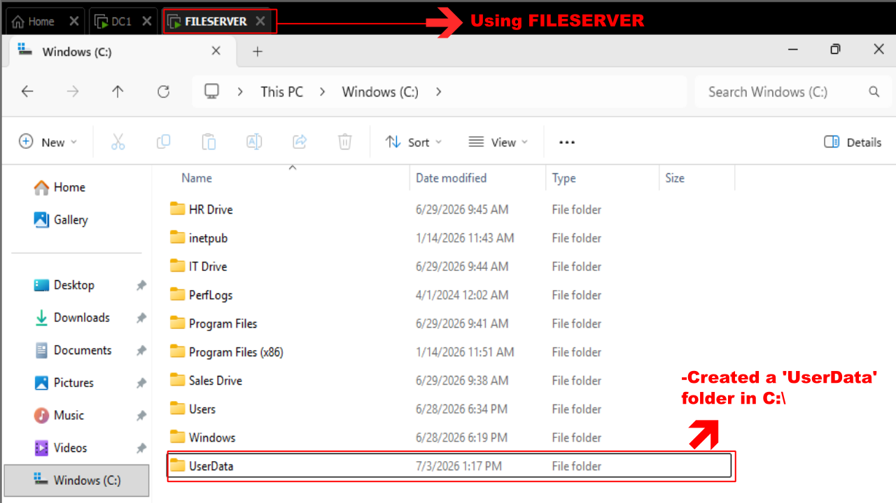
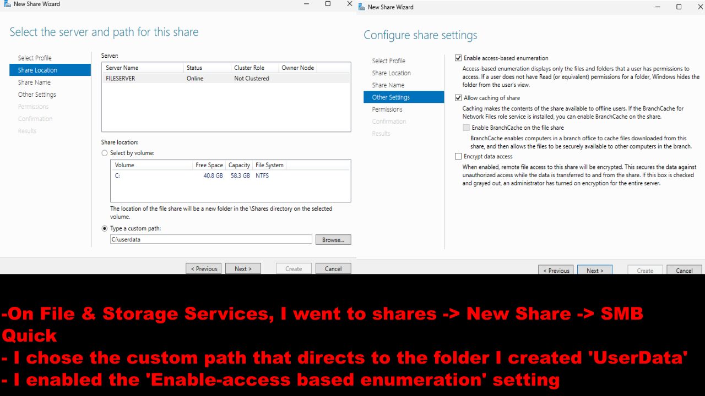
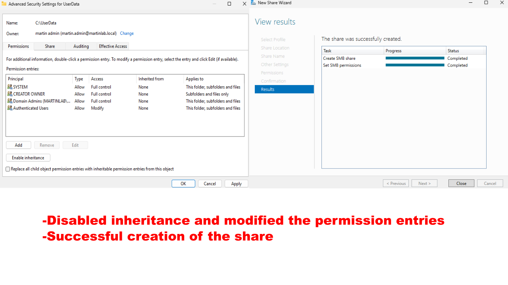
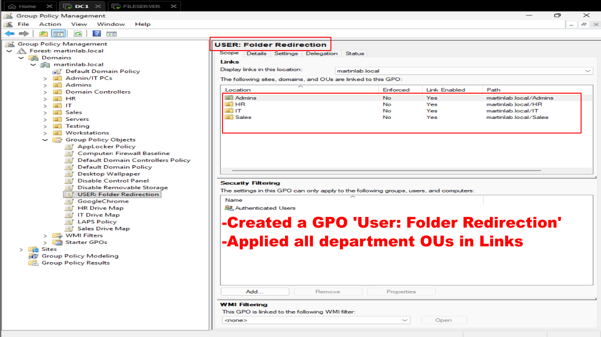

# Folder Redirection Lab

## Objective

Configure Folder Redirection using Group Policy to automatically redirect users' Desktop and Document folders from local workstations to a centralized file server. This provides centralized storage, easier backups, and allows users to retain their files regardless of which domain computer they log into.

## Steps Performed

1. Created the User Data Folder
  - Created a folder named UserData on the FILESERVER at: C:\UserData

2. Configured the SMB share
  -File and Storage Services -> Shares -> New Share -> SMB Share - Quick ->
  - Selected the C:\UserData folder - > Enabled Access-Based Enumeration

3. Configured Share Permissions
  - Disabled inheritance -> Configured the appropiate share and NTFS permissions for Folder Redirection ->
  - Completed the share creation wizard

4. Created the Folder Redirection Group Policy
  - Created a new Group Policy Object named: User: Folder Redirection
  - Linked the GPO to the following Organizational Units:
    - Sales, IT, HR, Admins

5. Configured Folder Redirection
  - User Configuration -> Policies -> Windows Settings -> Folder Redirection
  - Configured the following settings for Desktop and Documents:
    - Setting: Basic - Redirects everyone's folder to the same location
    - Entered the shared UserData root path
    - Enabled Grant the user exclusive rights to Documents
    - Enabled redirect the folder back to the local user profile location when policy is removed

6. Verified Folder Redirection
  - Logged in as the Sales1 domain user
  - Verified that document and desktop properties use the file server location path

7. Verified Folder creation on the File Server
  - The FILESERVER C drive showed the creation of Sales1 Folder for Desktop and Documents

## Result

Succesfully deployed Folder Redirection through Group Policy.

Users' Desktop and Document folders are now automatically redirected to the centralized file server, allowing files to be stored on the network instead of individual workstations. User folders are automatically created upon first login, simplifying centralized storage and improving data management within the Active Directory environment.
